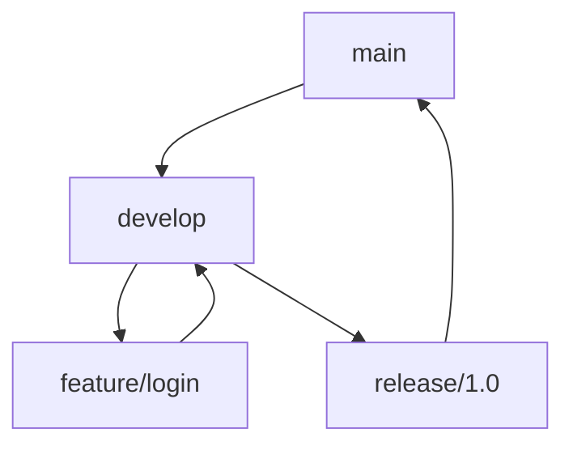

# 🤝 Вклад в проект Balloo

**Спасибо за интерес к проекту Balloo!**

---

## 📋 Содержание

1. [Как внести вклад](#как-внести-вклад)
2. [Конвенции кода](#конвенции-кода)
3. [Git workflow](#git-workflow)
4. [Code Review](#code-review)
5. [Релизы](#релизы)

---

## Как внести вклад

### 1. Найти задачу

- Проверьте [GitHub Issues](https://github.com/your-org/app-balloo/issues)
- Найдите задачу с меткой `good first issue` для начала
- Или создайте новую issue с описанием идеи

### 2. Создать ветку

```bash
# Клонировать репозиторий
git clone https://github.com/your-org/app-balloo.git
cd app-balloo

# Создать ветку
git checkout -b feature/your-feature-name
```

### 3. Разработать

**Изменения в разных компонентах:**

```bash
# Если нужны общие типы
cd shared
# Измените типы

# Для web
cd messenger
# Измените компоненты

# Для API
cd api
# Измените контроллеры
```

### 4. Протестировать

```bash
# Запустить тесты
npm test

# Проверить linting
npm run lint

# Запустить в разработке
npm run dev
```

### 5. Сделать commit

```bash
git add .
git commit -m "feat: описание функции"
```

**Конвенции commit messages:**

| Тип | Описание | Пример |
|-----|----------|--------|
| `feat` | Новая функция | `feat: добавить поиск по сообщениям` |
| `fix` | Исправление бага | `fix: исправить ошибку при логине` |
| `docs` | Документация | `docs: обновить README` |
| `style` | Форматирование | `style: отформатировать код` |
| `refactor` | Рефакторинг | `refactor: оптимизировать запросы` |
| `test` | Тесты | `test: добавить тесты для auth` |
| `chore` | Инструменты | `chore: обновить зависимости` |

### 6. Push и Pull Request

```bash
git push origin feature/your-feature-name
```

На GitHub создайте Pull Request:
- Выберите базовую ветку `main`
- Опишите изменения
- Прикрепите скриншоты (если UI изменения)
- Укажите связанные issues

---

## Конвенции кода

### TypeScript

```typescript
// Interfaces
interface User {
  id: string;
  email: string;
  name: string;
}

// Types
type UserId = string;

// Functions
function createUser(data: CreateUserDto): Promise<User> {
  // ...
}

// Classes
class UserService {
  async findById(id: string): Promise<User | null> {
    // ...
  }
}
```

### React Components

```typescript
// Functional components
interface Props {
  user: User;
  onLogout: () => void;
}

export const Header: React.FC<Props> = ({ user, onLogout }) => {
  return (
    <header>
      <span>{user.name}</span>
      <button onClick={onLogout}>Logout</button>
    </header>
  );
};
```

### API Controllers

```javascript
// controllers/auth.controller.js
const login = async (req, res) => {
  try {
    const { email, password } = req.body;
    
    // Validation
    if (!email || !password) {
      return res.status(400).json({ error: 'Email and password required' });
    }
    
    // Logic
    const user = await authService.login(email, password);
    
    res.json({ success: true, data: user });
  } catch (error) {
    logger.error('Login error:', error);
    res.status(500).json({ error: 'Internal server error' });
  }
};

module.exports = { login };
```

### Naming Conventions

| Тип | Convention | Пример |
|-----|------------|--------|
| Files (TS/JS) | camelCase | `authController.js`, `userService.ts` |
| Files (React) | PascalCase | `Header.tsx`, `UserProfile.tsx` |
| Variables | camelCase | `userName`, `isLoggedIn` |
| Constants | UPPER_SNAKE_CASE | `MAX_RETRY_COUNT` |
| Classes | PascalCase | `UserService`, `AuthController` |
| Interfaces | PascalCase | `User`, `CreateUserDto` |
| Types | PascalCase | `UserId`, `ChatType` |

---

## Git workflow

### Ветки

```
main              # Production ветка
develop           # Development ветка
feature/*         # Новые функции
fix/*             # Исправления багов
hotfix/*          # Критические исправления
release/*         # Подготовка релиза
```

### Git Flow



### Команды

```bash
# Создать новую функцию
git checkout -b feature/new-feature

# Обновить из main
git checkout main
git pull origin main
git checkout feature/new-feature
git merge main

# Завершить функцию
git checkout develop
git merge feature/new-feature
git branch -d feature/new-feature
```

---

## Code Review

### Процесс

1. **Автор** создаёт Pull Request
2. **Reviewer** получает уведомление
3. **Reviewer** проверяет код:
   - Функциональность работает
   - Код соответствует конвенциям
   - Тесты добавлены
   - Документация обновлена
4. **Автор** исправляет замечания
5. **Reviewer** мержит PR

### Чеклист reviewer'а

- [ ] Код работает как ожидается
- [ ] Нет Security уязвимостей
- [ ] Код читаемый и поддерживаемый
- [ ] Добавлены тесты
- [ ] Документация обновлена
- [ ] Нет лишних изменений
- [ ] Логирование добавлено

### Как получить review

```bash
# Попросить review
git push origin feature/your-feature

# На GitHub:
# 1. Откройте Pull Request
# 2. Выберите reviewers
# 3. Опишите изменения
```

---

## Релизы

### Версионирование

Используем **Semantic Versioning**: `MAJOR.MINOR.PATCH`

- **MAJOR** - Breaking changes
- **MINOR** - New features (backwards compatible)
- **PATCH** - Bug fixes

### Создание релиза

```bash
# Создать релиз
git tag v1.0.0
git push origin v1.0.0

# GitHub Actions создаст релиз автоматически
```

### Changelog

Обновите `CHANGELOG.md`:

```markdown
## [1.0.0] - 2026-04-25

### Added
- Регистрация пользователей
- Создание чатов
- Отправка сообщений

### Changed
- Улучшена производительность

### Fixed
- Исправлен баг при логине
```

---

## Вопросы?

- **GitHub Discussions** - [Обсудить идею](https://github.com/your-org/app-balloo/discussions)
- **Email** - admin@balloo.ru
- **Telegram** - @balloo_support

---

**Спасибо за ваш вклад в Balloo! 🎈**

**NLP-Core-Team**
