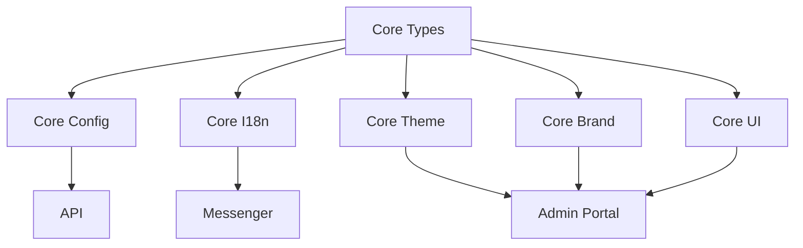

# Repository Structure

```
app_balloo/
├── packages/                    # Core packages
│   ├── core-types/             # Shared TypeScript types
│   ├── core-config/            # Configuration management
│   ├── core-i18n/              # Internationalization
│   ├── core-theme/             # Theme presets
│   ├── core-brand/             # Branding components
│   └── core-ui/                # UI components
├── api/                         # API service
├── messenger/                   # Messenger service
├── admin-portal/               # Admin web app
├── mobile/                      # React Native app
├── desktop/                     # Electron app
├── docker/                      # Docker configuration
├── SUMMARY_DOCS/               # Documentation site
└── workdocs/                   # Working documents
```

## Package Dependencies



## Branch Strategy

- `main` - Production ready
- `develop` - Development branch
- `feature/*` - New features
- `bugfix/*` - Bug fixes
- `release/*` - Release preparation
